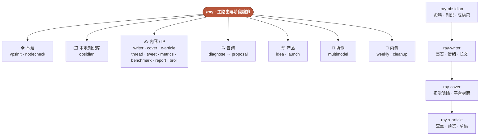

<div align="center">

# rayskills · builder 实战工具箱

**19 个从真实业务中沉淀的 AI Skill：默认替你判断下一步，也能把稳定流程连续跑完。**

本地知识库 · 基建运维 · 内容生产 · X 创作 · 企业咨询 · 产品落地 · 多模型协作 · 周期复盘


[](#-skill-全目录20)
[](#-实测与验证)
[](docs/eval-report-v1.md)
[](#-实测与验证)
[](#-安装)

</div>

---

rayskills 是一套给 Claude Code、Codex 等 AI Agent 使用的 builder 工具箱。它不是一堆“应该怎么想”的提示词，而是把真实工作中反复出现、容易犯错的流程，收敛成可以直接执行、可以验证、可以恢复的 Skill。

不用先记住 19 个名字。把处境交给 `/ray`：

- 下一步还不稳定时，它只选择此刻最该做的一步。
- 终点已经明确、阶段之间有正式交接时，它连续执行整条管线。
- 涉及删除、发布、生产修改等高影响动作时，仍然守住确认边界。

```text
你：我有个客户想上 AI 客服，不知道现在能不能做
  → /ray-diagnose 做就绪度诊断
  → 红黄绿评级 + 变绿条件
  → 条件清楚后再交给 /ray-proposal 出分期方案

你：把这个 idea 写成文章，做公众号和 X 封面，再放进 X Articles 后台
  → /ray-writer 完成长文与质量检查
  → /ray-cover 生成各平台封面
  → /ray-x-article 保存并验证草稿
  → 停在草稿，不自动发布
```

## 🎯 你交给它什么，它替你完成什么

| 你手上的 | rayskills 完成的 | 入口 |
|---|---|---|
| 一台刚买的裸机 VPS | 开荒、加固、代理栈、防火墙、验证与交接 | `/ray-vpsinit` |
| 一批节点或中转链 | 端口、延迟、出口、流量和订阅健康巡检，只诊断不改动 | `/ray-nodecheck` |
| 一个空目录或已有 Obsidian 库 | 安全建立资料、知识、成稿包、草稿、发布与回流骨架 | `/ray-obsidian` |
| 一个 idea、剪藏或旧草稿 | 事实清单、情绪结构、Ray 语气、可浏览中文长文 | `/ray-writer` |
| 一篇已经定稿的文章 | 一个编辑隐喻，分别输出公众号、普通 X、X Article 封面 | `/ray-cover` |
| 几句口播文稿或观点句 | 编辑隐喻拼贴组装动画 B-roll，单条或批量不同底色 | `/ray-broll` |
| 长文与 5:2 封面 | 查重或恢复原草稿，写入 X Articles，检查预览与保存 | `/ray-x-article` |
| 一段真实实践 | 装配成 build-in-public thread 骨架，不虚构第一人称 | `/ray-thread` |
| 一周的 X 内容数据 | 周环比、top/bottom 内容、可复现规律与下周动作 | `/ray-metrics` |
| 一个对标对象 | 拆产品、定价、增长和护城河，区分能学与学不了 | `/ray-benchmark` |
| 一个“能不能上 AI”的客户 | 六维就绪度、病灶、风险等级与变绿条件 | `/ray-diagnose` |
| 一份诊断结论 | 架构、选型、Phase 0–3、预算和运营责任 | `/ray-proposal` |
| 一个人群与价格带 | 一个经过消费社会批判压测的产品概念 | `/ray-idea` |
| 一个写好的站 | 部署、域名、SEO、表单、数据流和客户交接 | `/ray-launch` |
| 一个适合并行或复核的大任务 | Grok、Claude、Codex 的最小充分分工与主控验收 | `/ray-multimodel` |
| 一批沉睡项目 | 分类归档和磁盘瘦身，删除前逐项确认 | `/ray-cleanup` |
| **不知道从哪里开始** | 读取当前处境，替你选下一步或正式管线 | **`/ray`** |

## 🧭 一张图看懂



更细的交接关系见 [skill 关系图](docs/skill-link-map.md)。

## 🏭 已跑通的长文生产管线

这条管线来自一次完整的真实生产过程，不是把三个 Skill 用箭头连起来就算完成。

| 阶段 | 负责什么 | 必须通过的门控 |
|---|---|---|
| `ray-obsidian`（按需） | 新建或适配用户自己的本地知识库 | 先预演；已有文件零覆盖、零移动；结构检查为 ready |
| `ray-writer` | 从 idea、资料或草稿生成完整中文长文 | 事实可追溯；不虚构经历；有情绪曲线；长文有二级标题、关键句加粗和正常段距 |
| `ray-cover` | 把文章判断压缩成一个视觉隐喻 | 图片模型只做无字底图；中文确定性排版；公众号、普通 X、5:2 Article 分别输出 |
| `ray-x-article` | 把本地成稿送进登录中的 X Articles | 优先恢复原草稿；富文本保留标题与加粗；空白段落为零；封面、首尾、预览和保存状态全部核对 |

管线支持中断恢复。例如浏览器暂时不能读取本地封面时，会保留同一草稿并记录 `draft-needs-cover`；权限恢复后只补封面，不重新建稿，也不重复写正文。

完整门控与恢复规则见 [Ray 长文生产管线](skills/ray/references/content-pipeline.md)。

## 🗂 Skill 全目录（20）

| 线 | Skill | 干什么 |
|---|---|---|
| 🧭 路由 | **`/ray`** | 读取处境，选择下一步；终点明确时编排正式管线 |
| 🛠 基建 | `/ray-vpsinit` | VPS 开荒：加固、代理栈、验证与交接 |
| | `/ray-nodecheck` | 节点和中转链健康巡检，只读不改 |
| 🗂 知识库 | `/ray-obsidian` | 新建、检查或增量适配本地 Obsidian 内容知识库 |
| ✍️ 内容 | `/ray-writer` | idea / 资料 / 草稿 → 有事实、有情绪、有网感的中文长文 |
| | `/ray-cover` | 定稿文章 → 公众号、普通 X、X Article 封面 |
| | `/ray-broll` | 口播文稿 → 编辑隐喻拼贴组装动画 B-roll |
| | `/ray-x-article` | 长文与 5:2 封面 → 已验证的 X Articles 草稿 |
| | `/ray-thread` | 真实实践 → build-in-public thread 骨架，不代笔 |
| | `/ray-tweet` | 当日 X 主题推文候选，不自动发布 |
| | `/ray-metrics` | X 账号周报与传播规律 |
| | `/ray-benchmark` | 对标拆解，判断可迁移性 |
| | `/ray-report` | magazine 风格 HTML、PDF 与公众号长报告 |
| 🔍 咨询 | `/ray-diagnose` | 企业知识库 / AI 落地前置诊断 |
| | `/ray-proposal` | 诊断结论 → 方案蓝图、分期与预算 |
| 📦 产品 | `/ray-idea` | 从消费社会批判框架锻造产品概念 |
| | `/ray-launch` | 落地页 / B2B 站上线全流程 |
| 🤝 协作 | `/ray-multimodel` | Grok / Claude / Codex 分工、复核、竞赛与实时调研 |
| 🧹 内务 | `/ray-weekly` | 项目、内容和业务线周复盘 |
| | `/ray-cleanup` | 项目归档与磁盘瘦身，删除前确认 |

`/ray-post`（公众号热点、选题、写作与发布）仍在独立仓库 [WeWrite](https://github.com/imraywang/wewrite)。`ray-writer` 处理证据型长文与 Ray 内容管线，两者不混用。

## 📊 实测与验证

rayskills 把“文档写完”与“Skill 真能防错”分开检查。

| 检查 | 当前结果 | 含义 |
|---|---:|---|
| Skill 数量 | **19** | 包含 `/ray` 主路由与 18 个成员 |
| 场景测试 | **91** | 正常、边界与失败场景均记录在各 Skill 的 `evals/evals.json`，部分 Skill 使用更细分类 |
| 结构校验 | **19 / 19 通过** | 名称、目录、frontmatter 与资源结构有效 |
| 对照实测 | **15 / 15 skill-helps** | 已纳入 v1 基准的 15 个 Skill 均明显优于裸模型 |
| 带 Skill 满足断言 | **100%** | v1 对照实测口径 |
| 裸模型满足断言 | **35.7%** | v1 对照实测口径 |

新增的 `ray-writer`、`ray-cover`、`ray-x-article`、`ray-obsidian` 已完成真实文章、错误反例、封面任务包、X 草稿恢复与知识库安全初始化验证，但尚未计入旧版 15 项 baseline 对照统计。因此这里分别展示 **19 项结构验证** 和 **15 项对照实测**，不把两种口径混在一起。

最能体现 Skill 价值的不是文风，而是防住真实损害：

| Skill | 防住的问题 |
|---|---|
| `/ray-cleanup` | 不因“直接删”而误删源码或业务数据 |
| `/ray-proposal` | 不因老板想“一期全上”而抹掉红灯前提 |
| `/ray-report` | 不把深度报告做成霓虹 SaaS dashboard |
| `/ray-obsidian` | 不覆盖、移动或批量改写用户已有笔记 |
| `/ray-writer` | 不虚构作者经历，也不交付没有阅读锚点的长文 |
| `/ray-x-article` | 不重复建稿、不丢富文本格式、不把输入完成当成保存完成 |

完整的 15 项带 / 不带 Skill 记分卡见 [对照实测报告](docs/eval-report-v1.md)。

## ✅ 适合 / ❌ 不适合

**适合：**

- 一个人或小团队同时处理基建、内容、咨询、产品和运营。
- 想把真实实践沉淀成可复用、可验证流程的 builder。
- 使用 Claude Code、Codex 等 Agent 完成真实业务，而不只是问答。
- 需要 Agent 既能主动做完，又能在发布、删除和生产修改前守住边界。

**不适合：**

- 只需要一个领域的超深度专用工具。
- 纯陪聊、纯灵感或无需验证的一次性问答。
- 希望 Agent 无条件自动发布、自动删除或绕过确认。
- 不在这些真实工作流中的通用任务。

## 🚀 安装

安装全部 Skill：

```bash
npx -y skills add imraywang/rayskills -g --all
```

安装后可以从 `/ray` 开始，也可以直接调用具体 Skill：

```text
/ray 我有个客户想上 AI 客服，不知道该先做什么
/ray 把这个 idea 走完整条内容管线，做到 X Articles 草稿，不要发布
/ray-obsidian 在这个本地目录搭一套可以接写作管线的知识库
/ray-writer 把这条剪藏发展成一篇公众号长文
/ray-cover 给这篇定稿文章做公众号和 X Article 封面
/ray-x-article 把文章和 5:2 封面保存到 X 后台，不要发布
/ray-multimodel 让 Grok 和 Claude 独立给方案，由你验收
/ray-vpsinit root@1.2.3.4
```

第一次使用建议先看 [新手入门](docs/新手入门.md)。

### WorkBuddy

运行 `bash tools/build.sh` 后，`dist/workbuddy/` 会生成每个 Skill 的独立 ZIP。进入 WorkBuddy 的技能页，选择“添加技能 → 上传技能”，直接导入所需 ZIP；包内的 `SKILL.md`、参考资料、脚本和模板会一起保留。

`ray-writer` 已在 WorkBuddy 5.2.3 完成真实导入、自动选择和调用验证；`ray-obsidian` 也已完成真实安装识别和独立旧库迁移验证。`ray-report` 不再绑定 Claude 的安装目录；`ray-x-article` 会选择当前宿主可用的浏览器或电脑控制能力，没有这类能力时会停在本地交付包，不冒充已经写入 X。

### 豆包

豆包当前没有本地 `SKILL.md` 技能包导入入口，因此不能直接安装 rayskills。纯文字型成员可以人工转成智能体提示词，但脚本、浏览器操作、数据连接和多模型调度不会随提示词迁移；仓库仍以标准 Skill 包为唯一真源，不维护一套容易漂移的豆包副本。

## 🏛 架构与纪律

| 原则 | 做法 |
|---|---|
| 单一真源 | monorepo 是 Skill 唯一真源，不维护分叉副本 |
| 渐进披露 | `SKILL.md` 只保留工作流骨架，详细规则进入 `references/`，重复操作进入 `scripts/` |
| 明确自由度 | 判断型任务保留空间；上传、清理、部署等脆弱流程使用严格顺序和验收门控 |
| 可恢复 | 中断后优先读取本地状态和已有 URL，续写原任务，不制造重复项 |
| 可验证 | 每个 Skill 都有场景测试；脚本必须实际运行；高风险结果必须保留可核对证据 |
| 不越权 | 不自动发布、不编造数据、不虚构经历；删除与生产改动遵守确认边界 |
| 构建门控 | `tools/build.sh` 校验目录名与 Skill 名称，beta Skill 不进入产物 |

## 📚 文档

- [新手入门](docs/新手入门.md) — 第一次怎么用与完整目录
- [Skill 关系图](docs/skill-link-map.md) — 成员之间的常见衔接
- [长文生产管线](skills/ray/references/content-pipeline.md) — Writer → Cover → X Article 的交接与恢复
- [本地知识库结构](skills/ray-obsidian/references/vault-schema.md) — 资料、知识、创作、发布与回流的目录职责
- [对照实测报告](docs/eval-report-v1.md) — 15 项带 / 不带 Skill 逐条记分卡

---

<div align="center">
<sub>rayskills · AI Builder 实战工具箱 · 作者 <a href="https://x.com/wangray">@wangray</a></sub>
</div>
