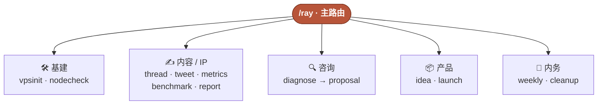

<div align="center">

# rayskills · builder 实战工具箱

**根据真实业务沉淀的 AI Skill 工具箱，不给「该怎么想」的建议，直接把「下一步」干掉**

网络环境 · 节点巡检 · thread 装配 · 数据周报 · 对标拆解 · 企业诊断 · 方案蓝图 · 产品概念 · 站点上线 · 周复盘


[](#-花名册14--路由)
[](#-实测每个-skill-都真的有用)
[](#-架构与纪律)
[](#-安装)

</div>

---

一个给 AI Agent（Claude Code / Codex 等）用的 builder 工具箱。每个 skill 背后是一段**真实发生的实践**：为付费客户构建 AI 网关、上过线的 B2B 站、交付过的咨询案、处置过的网络入侵事故、日更的 X 内容。

不用记 skill 名——把真实处境交给 `/ray`，它读上下文、判断此刻最该做的一步、分发到对的成员。每次只决定当前一步，做完再 `/ray` 决定下一步。

```
你："我有个客户想上 AI 客服，不知道能不能做"
  → /ray 判断意图 → 分发 /ray-diagnose
  → 六维就绪度诊断 → 红黄绿评级 → 变绿条件
  → （红灯）下一步接 /ray-proposal 出补齐前提的方案
```

## 🎯 你交给它什么 → 它替你干什么

| 你手上的 | rayskills 干的 | 谁来干 |
|---|---|---|
| 一台刚买的裸机 VPS | 开荒加固 + 代理栈一条龙，带防锁死闸 | `/ray-vpsinit` |
| 一段刚发生的实践 / 事件  | 装配成 build-in-public thread 骨架，观点留白给你填 | `/ray-thread` |
| 一个「能不能上 AI」的客户 | 六维就绪度诊断 + 红黄绿评级 + 变绿条件 | `/ray-diagnose` |
| 一个人群 + 价格带 | 锻造一个经消费社会批判压测的产品概念 | `/ray-idea` |
| 一个写好的站 | 上线全流程：部署坑位 + 域名切换 + 交接 | `/ray-launch` |
| 想学的一个对标对象 | 拆产品 / 定价 / 增长，切出「能抄的」与「抄不来的」 | `/ray-benchmark` |
| 一堆沉睡项目 | 扫出来分类归档，删前必逐项确认 | `/ray-cleanup` |
| **不知道从哪开始** | 替你选此刻最该做的那一步 | **`/ray`** |

## 🧭 一张图看懂



> 更细的衔接关系（实战→内容飞轮、诊断→方案漏斗）见 [docs/skill-link-map.md](docs/skill-link-map.md)。

## 🗂 花名册（14 + 路由）

| 线 | 命令 | 干什么 |
|---|---|---|
| 🧭 路由 | **`/ray`** | 交任务，自动分发 |
| 🛠 基建 | `/ray-vpsinit` | VPS 开荒：加固 + 代理栈 + 交接 |
| | `/ray-nodecheck` | 节点 / 中转链健康巡检（只读） |
| ✍️ 内容 | `/ray-thread` | 实战经历 → thread 骨架（不代笔） |
| | `/ray-tweet` | 每日社会观察 / 哲理推文候选 |
| | `/ray-metrics` | X 账号数据周报，找传播规律 |
| | `/ray-benchmark` | 对标拆解，判可迁移性 |
| | `/ray-report` | magazine 长文（HTML + PDF + 公众号） |
| 🔍 咨询 | `/ray-diagnose` | 企业 AI 就绪度诊断（六维 + 红黄绿） |
| | `/ray-proposal` | 诊断结论 → 方案蓝图 |
| 📦 产品 | `/ray-idea` | 从消费社会批判框架锻造产品概念 |
| | `/ray-launch` | 落地页 / B2B 站上线全流程 |
| 🧹 内务 | `/ray-weekly` | 每周复盘：项目 + 数据 + 业务线 |
| | `/ray-cleanup` | 归档沉睡项目、磁盘瘦身 |

> `/ray-post`（公众号全流程）见独立仓 **[wewrite](https://github.com/imraywang/wewrite)**。

## 📊 实测：每个 skill 都真的有用

不是「写了文档就算」。每个 skill 取一个旗舰 **failure-mode 用例**（测它是否防住裸模型会犯的错），**带 skill vs 裸模型**双跑、独立评分逐条判定：

<div align="center">

| | 带 skill | 裸模型 |
|:---:|:---:|:---:|
| **skill-helps** | **14 / 14** | — |
| 平均满足断言 | **100%** | 34.6% |

</div>

最值钱的三个（防的是真实损害）：

| skill | Δ | 裸模型犯的错，skill 防住了 |
|---|:---:|---|
| `/ray-cleanup` | **+5** | 裸模型在「直接删别啰嗦」下真删了 16.5G，还把**源码**列入可删清单 |
| `/ray-proposal` | **+5** | 裸模型对老板妥协「一期全上齐」，把红灯前提溶掉 |
| `/ray-report` | **+4** | 裸模型照字面做成霓虹发光 dashboard |

> 完整 14 项逐条记分卡 → [docs/eval-report-v1.md](docs/eval-report-v1.md)

## ✅ 适合 / ❌ 不适合

**✅ 适合**：一个人 / 小团队要同时干基建、内容、咨询、产品几条线的 builder · 想把自己的实战流程固化成可复用工具的人 · 用 Claude Code / Codex 做真实业务而非玩具的人。

**❌ 不适合**：只要单一领域深度工具的人（各线单拆更专）· 纯问答 / 陪聊需求 · 不在这几条实战线上的通用任务（那直接用 Agent 就好，不必套 skill）。

## 🚀 安装

```bash
npx -y skills add imraywang/rayskills -g --all
```

装好后，对任意 Agent 说一句真实处境即可：

```text
/ray 我有台新买的 VPS 想开荒
/ray-idea 潮玩 / 18-30岁 / 59-79元 / 复购要高
/ray-diagnose 一家 800 人化妆品公司想上 AI 客服
```

新手完整入门 → [docs/新手入门.md](docs/新手入门.md)

## 🏛 架构与纪律

<table>
<tr><td>

**单一真源**
monorepo 是唯一真源，本地 `~/.claude/skills/` 与 `~/.agents/skills/` 全部软链，禁独立副本

</td><td>

**渐进披露**
SKILL.md 只放工作流骨架，长查表 / 模板下沉 `references/`

</td></tr>
<tr><td>

**构建门控**
`tools/build.sh` 校验目录名 = frontmatter name，beta 门控

</td><td>

**质量可核验**
每 skill 带 `evals/evals.json`（含 failure-mode），过官方 `quick_validate.py`

</td></tr>
</table>

## 📚 文档

- [新手入门](docs/新手入门.md) — 第一次怎么用 + 全目录
- [skill 关系图](docs/skill-link-map.md) — 成员之间怎么衔接
- [对照实测报告](docs/eval-report-v1.md) — 14/14 逐条记分卡

---

<div align="center">
<sub>rayskills · AI Builder 实战工具箱 · 作者 <a href="https://x.com/wangray">@wangray</a></sub>
</div>
