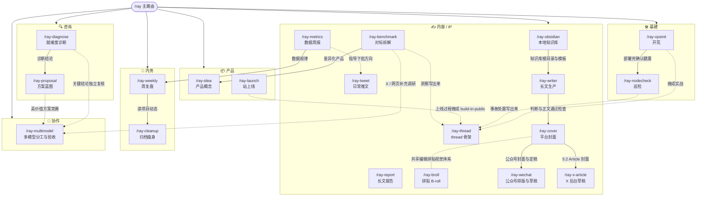

# rayskills 关系图

`/ray` 是主入口，默认读上下文分发到一个成员 skill。用户明确要求从 idea 一路做到公众号或 X 草稿时，使用已经验证的内容生产管线连续执行；线上写入和发布仍分别守住确认边界。

## 衔接逻辑

- **咨询漏斗**:`ray-diagnose`(免费诊断,漏斗入口)→ `ray-proposal`(付费方案)。红灯诊断时,方案 Phase 0 = 补齐前提。
- **实战 → 内容飞轮**:任何一段实战(开荒/巡检/上线/事故)完成后,`ray-thread` 或 `ray-tweet` 把它变成 IP 素材(守不代笔)。
- **数据 → 决策**:`ray-metrics` 的规律喂 `ray-weekly` 的内容数据节,并指导 `ray-tweet` 下一批方向。
- **对标 → 产品**:`ray-benchmark` 拆完可迁移点,`ray-idea` 锻造差异化产品概念。
- **知识库 → 长文 → 封面 → 平台草稿**：没有兼容知识库时，`ray-obsidian` 先安全建立资料、知识、成稿包、草稿和发布结构；`ray-writer` 完成事实、情绪、二级标题、重点加粗和段落检查；`ray-cover` 从核心判断生成无字底图并确定性排版；`ray-wechat` 负责公众号排版、预览确认、原草稿更新和 UTF-8 回读；`ray-x-article` 负责 X 草稿续写或查重、富文本写入、封面裁切、预览和保存。用户明确要求完整管线时连续执行，线上写入与发布仍由用户确认。
- **主控 → 外部通道**:`ray-multimodel` 只在大体量执行、独立复核、方案竞赛或 X 实时调研有明确收益时启用;当前会话始终负责最终验收。
