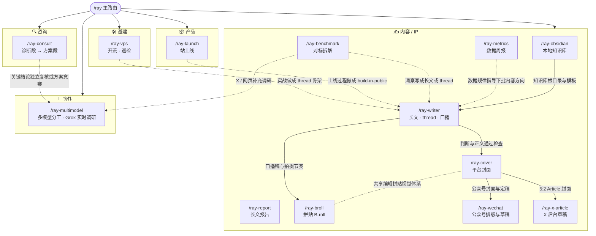

# rayskills 关系图

`/ray` 是主入口，默认读上下文分发到一个成员 skill。用户明确要求从 idea 一路做到公众号或 X 草稿时，使用已经验证的内容生产管线连续执行；线上写入和发布仍分别守住确认边界。

## 衔接逻辑

- **咨询漏斗**:`ray-consult` 内部完成诊断段(免费诊断,漏斗入口)→ 方案段(付费方案)的正式交接。红灯诊断时,方案 Phase 0 = 补齐前提。
- **实战 → 内容飞轮**:任何一段实战(开荒/巡检/上线/事故)完成后,`ray-writer` 的 thread 骨架模式把它变成 IP 素材(守不代笔)。
- **数据 → 决策**:`ray-metrics` 的规律指导下一批内容的方向与形式,不代笔具体文案。
- **对标 → 内容**:`ray-benchmark` 拆完可迁移点,交 `ray-writer` 写成长文或 thread。
- **知识库 → 长文 → 封面 → 平台草稿**：没有兼容知识库时，`ray-obsidian` 先安全建立资料、知识、成稿包、草稿和发布结构；`ray-writer` 完成事实、情绪、二级标题、重点加粗和段落检查；`ray-cover` 从核心判断出发,默认 Image 2 直出并逐字检查,必要时回退无字底图 + 确定性排版；`ray-wechat` 负责公众号排版、预览确认、原草稿更新和 UTF-8 回读；`ray-x-article` 负责 X 草稿续写或查重、富文本写入、封面裁切、预览和保存。用户明确要求完整管线时连续执行，线上写入与发布仍由用户确认。
- **母稿 → 多次分发**：`ray-writer` 把通过检查的长文作为唯一真源，重新选一个适合视频的判断，生成带母稿指纹的口播稿、拍摄节奏和素材清单；需要拼贴画面时再交给 `ray-broll`。公众号和 X 继续各自做格式转换，图片长文先保留视觉接口，后续再接独立样式系统。
- **主控 → 外部通道**:`ray-multimodel` 只在大体量执行、独立复核、方案竞赛，或 X / Reddit / 网页实时调研有明确收益时启用。`scout` 使用隔离的 Grok 搜索流程，默认 quick，明确要求深度核实时使用 deep；当前会话始终负责最终验收。

## 精简说明（v2）

v2 按成熟度做过一轮精简：`ray-diagnose` + `ray-proposal` 合并为 `ray-consult`，`ray-vpsinit` + `ray-nodecheck` 合并为 `ray-vps`，`ray-thread` 并入 `ray-writer` 的 thread 骨架模式；`ray-tweet`、`ray-idea`、`ray-cleanup`、`ray-weekly` 删除。合并项的完整方法论与 eval 场景随合并保留。
