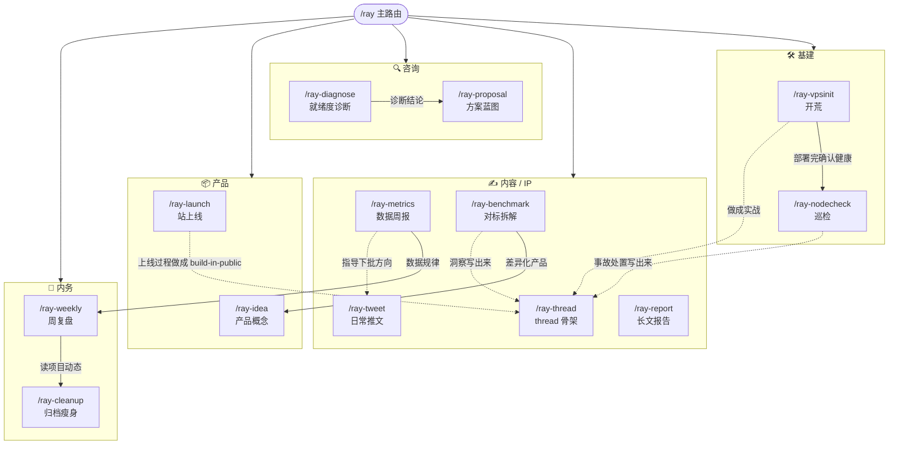

# rayskills 关系图

`/ray` 是主入口,读上下文分发到成员 skill。下面是成员之间的常见衔接(不是固定流水线,是"上一个结果出来后通常接哪个")。

## 衔接逻辑

- **咨询漏斗**:`ray-diagnose`(免费诊断,漏斗入口)→ `ray-proposal`(付费方案)。红灯诊断时,方案 Phase 0 = 补齐前提。
- **实战 → 内容飞轮**:任何一段实战(开荒/巡检/上线/事故)完成后,`ray-thread` 或 `ray-tweet` 把它变成 IP 素材(守不代笔)。
- **数据 → 决策**:`ray-metrics` 的规律喂 `ray-weekly` 的内容数据节,并指导 `ray-tweet` 下一批方向。
- **对标 → 产品**:`ray-benchmark` 拆完可迁移点,`ray-idea` 锻造差异化产品概念。

